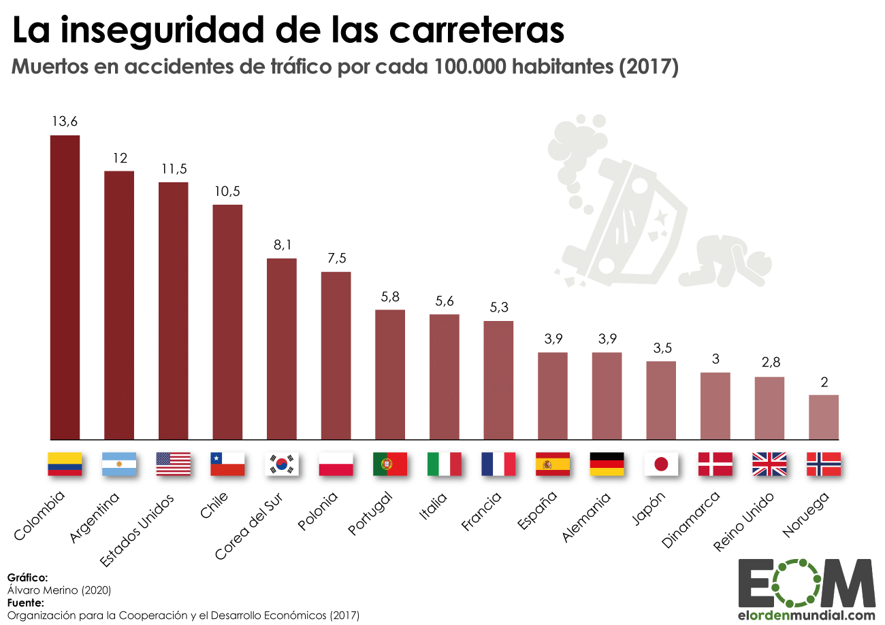

# PROYECTO INDIVIDUAL - DATA ANALYST
### WALTER MATIAS AMENGUAL

## Análisis de Accidentes de Tránsito en Argentina

## Introducción

Argentina ha alcanzado posiciones destacadas en Suramérica en relación con los accidentes de tránsito. En un censo realizado en 2017, el país se ubicó en el puesto Nº2 en el ranking de naciones con más fallecimientos debido a accidentes, tanto en entornos urbanos como en rutas del interior.

Ninguna localidad del país está exenta de sufrir accidentes de este tipo. Los impactos de los accidentes de tránsito, además del costo económico a nivel privado y público, incluyen daños irreparables a nivel personal, físico y psicológico. Esto afecta a familias enteras, generando problemas jurídicos y destacando una significativa problemática a nivel socio-cultural.

## Acciones Necesarias

Ante estas razones, es imperativo que tanto los gobiernos como los ciudadanos tomen medidas para erradicar este problema. Analizar estrategias y ponerlas en práctica diariamente es esencial para crear conciencia en la población sobre la importancia del respeto y cuidado al conducir vehículos y transitar por las calles. Esto no solo beneficia a nivel individual sino que también fomenta el respeto hacia los demás que comparten el entorno diario.

Gobiernos y fuerzas de seguridad constantemente desarrollan estrategias para controlar y reducir la cantidad de accidentes, así como las lamentables pérdidas de vidas causadas por estos eventos.

## Experiencia Personal

Como profesional que ha atendido diversos casos de accidentes, he presenciado de cerca la magnitud de este problema. Desde asistir judicialmente hasta socorrer a víctimas y atender familias afectadas, he vivido situaciones desgarradoras. La pérdida de un ser querido debido a un accidente de tránsito afecta profundamente a las familias, amigos y comunidades, tocando a cada uno de nosotros de manera cercana.

## Estrategias de Prevención

Para evitar estos incidentes o reducir su incidencia, se llevan a cabo diversas actividades, como controles en la calle, pruebas de alcoholemia, controles vehiculares, evaluaciones técnicas y campañas mediáticas. Una actividad fundamental es el análisis de los resultados de la toma de datos relacionados con estos eventos.

## Tarea Propuesta

En el marco del bootcamp de Data Science de Henry, asumo el rol de analista de datos para medir y analizar datos relacionados con accidentes de tránsito en Argentina, especificamente CABA. Iniciaré adquiriendo y analizando los datasets, corrigiendo errores y preparando la información para el análisis.

## Herramientas Utilizadas

### Para esta tarea, he empleado diversas herramientas y tecnologías:

* Visual Studio Code para el análisis de datos.
* Power BI de Microsoft para la visualización de datos.
* Python con bibliotecas como Pandas, Numpy, Matplotlib y Seaborn para el procesamiento y análisis de datos.
* Jupyter Notebooks para el desarrollo y documentación del código.

## Agradecimientos

Quiero expresar mi agradecimiento a Henry, a los mentores y a la comunidad de estudiantes por su apoyo. También agradezco a mi familia por su paciencia y cariño, elementos fundamentales para alcanzar nuestros objetivos.

## Enlaces Relevantes
[ETL](https://github.com/KamusDroid/PI_DA_SiniestrosViales/blob/main/ETL.ipynb)

[EDA](https://github.com/KamusDroid/PI_DA_SiniestrosViales/blob/main/EDA.ipynb)

[DASHBOARD](https://github.com/KamusDroid/PI_DA_SiniestrosViales/blob/main/DASHBOARD.pbix)

[LinkedIn](https://www.linkedin.com/in/sumakorama/)

Saludos a todos los que lean este análisis, y espero una participación activa en este repositorio junto con un valioso feedback.
